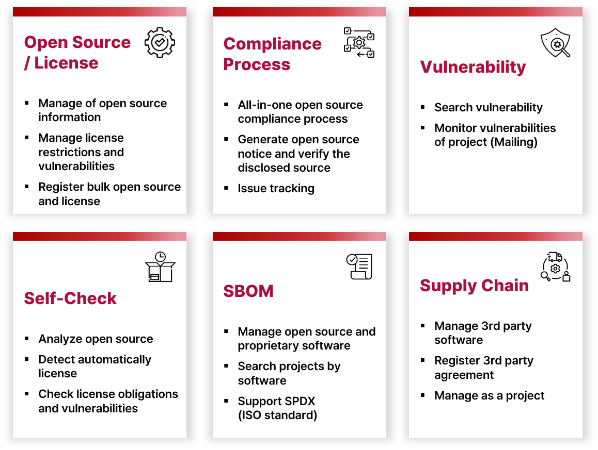

* toc
{:toc}

## What is FOSSLight Hub?

 
FOSSLight Hub helps you use the open source software compliantly and securely by managing open source, license and also vulnerability. Also it can process the OSC (Open Source Compliance) process by managing BOM for each project and track issues on open source license obligations and vulnerabilities.     
If you want to know more information about open source compliance, then you can refer the <a href="https://opensource.lge.com/guide/10?lang=en"><b>OSC Process Guide</b></a>.

## Features

 

## Documentation

We provide the guide for the installation and how to use it.  
Please refer the <a href="https://fosslight.github.io/fosslight-guide-en/"><b>FOSSLight Guide</b></a>.

## Source Code

Github Repository : <a href="https://github.com/fosslight/fosslight"><b>https://github.com/fosslight/fosslight</b></a>

## License

FOSSLight Hub is licensed under <a href="https://opensource.org/licenses/AGPL-3.0"><b>AGPL-3.0 License</b></a>.

## Contact

Join to FOSSLight Community on Slack! : [**https://fosslight.slack.com**](https://fosslight.slack.com)  
You can also post bug reports and feature requests in [**Github issues**](https://github.com/fosslight/fosslight/issues).

## Release Notes

You can check the latest release notes in
[**Release Notes (English version)**](https://github.com/fosslight/fosslight/blob/main/RELEASE_NOTES.md).