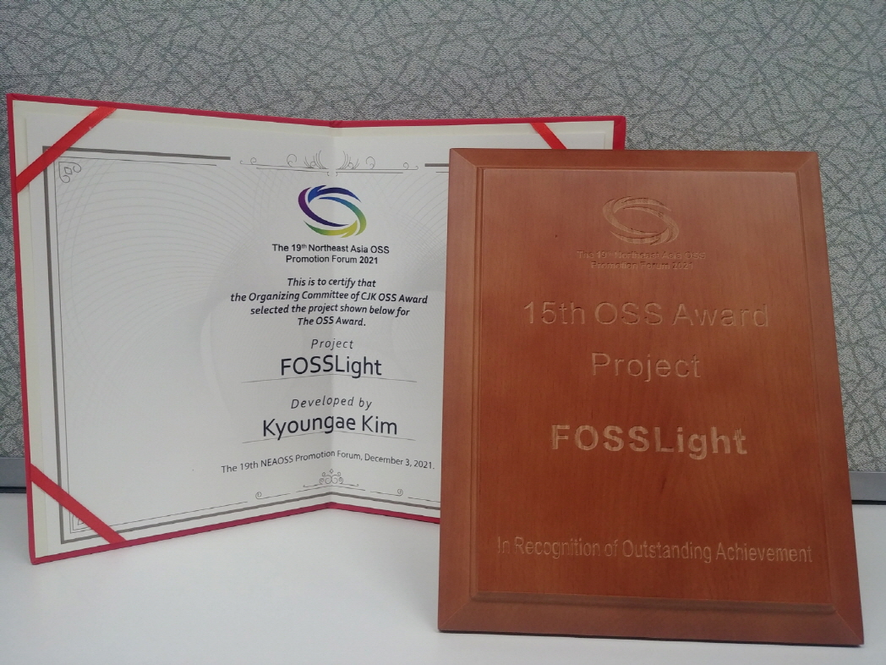

At the 19th [Northeast Asia OSS Promotion Forum](https://www.oss.kr/nea_forum), FOSSLight was introduced under the theme of 'Open Source Governance complete with FOSSLight'. Please note that the presentation video is provided with Chinese and Japanese subtitles. I'm pleased inform that FOSSLight won the 15th OSS Award Project award at this event. Please join us in congratulating this award! 🎊🎉

- Presentation video : [https://www.youtube.com/watch?v=ECZNNdm9CGc](https://youtu.be/ECZNNdm9CGc)
  - About the event : [https://www.oss.kr/event/show/f44e68b5-c8e3-48f1-8ec7-cdfc94e3b1e3](https://www.oss.kr/event/show/f44e68b5-c8e3-48f1-8ec7-cdfc94e3b1e3)
